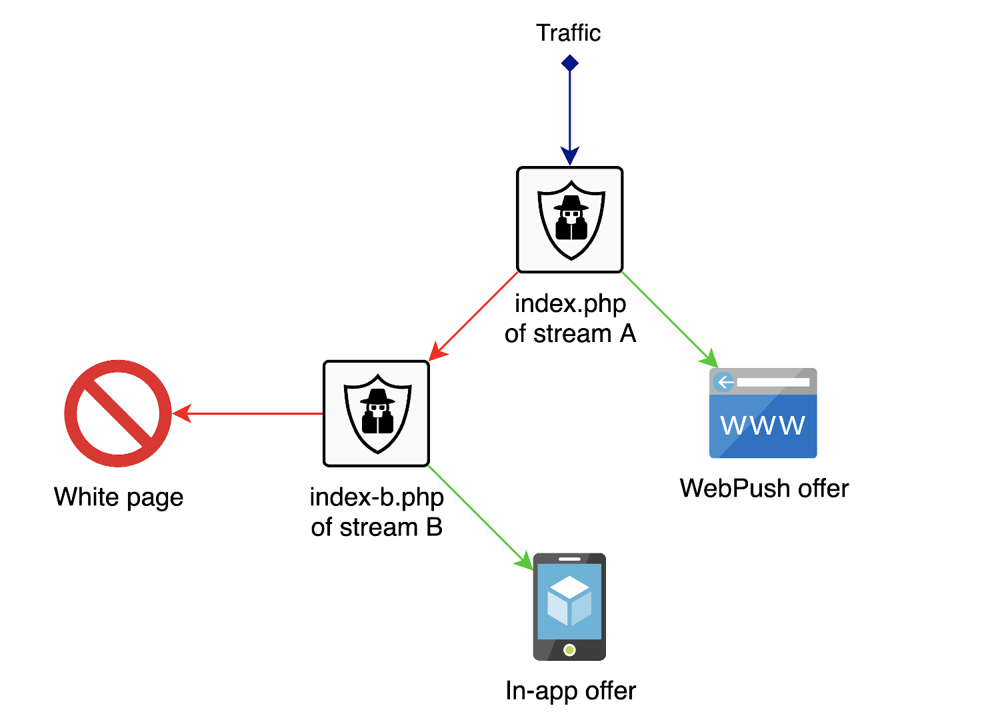

# Tips and Tricks

The flexible nature of `index.php` files employed by Adspect combined with file-based page display
mechanism (which uses the `require()` language construct of PHP) allows for more sophisticated setups
of streams. In this chapter we will describe several advanced scenarios that may be very useful to you.

## Stream Chaining

Since `index.php` is a regular PHP script, it may be used as a money page or a white page of a stream,
that is, one stream may redirect visitors to another stream, letting you chain them in different
ways. Typical setup of stream chaining is best described by example of a real-world application.

Suppose you have an ad campaign in a source that supplies both browser-based and mobile app-based
visitors in a mix without providing any option to split them. Such networks exist–push notifications
networks that have both [WebPush](https://developer.mozilla.org/en-US/docs/Web/API/Push_API) subscribers
and subscribers for in-app or [PWA](https://developer.mozilla.org/en-US/docs/Web/Progressive_web_apps)
notifications. You would like to split these traffic types and send them to different affiliate offers:
`https://example.com/webpush-offer` for WebPush-based visitors and `https://example.com/inapp-offer`
for mobile app-based visitors.

You can accomplish this by chaining two streams that have different settings for mobile app-based
visitors. The first stream A accepts incoming clicks and filters out app-based ones to its white page.
The second stream B is attached to the first one as its white page and filters out bots and moderators,
letting legitimate app-based visitors through to the separate offer.

Here are the relevant settings of the entryway stream A:

* Money page: `https://example.com/webpush-offer`
* White page: `index-b.php`
* Allow traffic from mobile apps: *disabled*

The relevant settings of the rear stream B:

* Money page: `https://example.com/inapp-offer`
* White page: `https://google.com/`
* Allow traffic from mobile apps: *enabled*

The mobile apps setting of stream A is what makes it consider app-based visitors as malicious and send
them all to stream B along with actual bots and moderators. Stream B will in turn re-analyze the traffic
and send good app-based clicks to the in-app offer while still filtering out unwanted visitors to Google.

Finally, you would place `index.php` files of both streams into the same directory: leave the `index.php`
file of stream A named as is and rename the file of stream B to `index-b.php`, which will act as a surrogate
white page of stream A.

## Dedicated IP Blacklist Stream

Streams have a useful “Blacklist all IP addresses in “Review” mode” setting for collecting IP blacklists
of moderators during the “Review” phase of stream lifecycle. This setting may be used to create a dedicated
stream for the purpose of collecting a single blacklist of all moderators, bots, etc.

The process is as follows:

1. Create a separate stream that will be used for accumulating IP addresses in its blacklist. Set and leave
   it in the “Review” mode and enable the “Blacklist all IP addresses in “Review” mode” setting. Effectively,
   this means that the stream will blacklist IP addresses of every visitor.

2. Use the stream's `index.php` file as a white page for other streams as described in [Stream Chaining](tips.html#stream-chaining) above.
   This will direct all bad visitors to the blacklisting stream, making it collect their IP addresses.
   Alternatively, you may use the stream as a white page only during the “Review” phase of other streams to
   exclude IP addresses of regular bots from the blacklist as it may possibly lead to false positives
   (please read [this chapter](filtering.html#blacklisting) for an explanation of why this may happen.)

3. Watch the IP blacklist of your dedicated stream being collected and copy-paste it into other streams
   every once in a while (yes, this isn't very convenient, we are working on a solution for blacklist sharing.)

## Combining Cloakers

In case you have access to other cloaking and traffic protection solutions, you may use them together with
Adspect to attain potentially higher levels of protection at the expense of additional processing latency.
Since most of our competing solutions have a notion of money and white (safe) pages, you should always put
Adspect at the rear side of the cloaker chain and create a special setup with two separate streams:

* One stream will be used as a money page of your front-side cloaker, taking the baton from it and inspecting
  supposedly good visitors that the cloaker has allowed through. The money page of this stream will be your
  final traffic destination whereas the white page will be the real white page that your intend to cloak with.
  This stream should be set to the "Filtering" mode.

* Another stream will be used as a white (safe) page of your front-side cloaker, accepting traffic from it
  in order to collect an IP address blacklist of visitors that the front-side cloaker deems dangerous and
  additionally train our [VLA](vla.md) machine learning system on their results. This data lets us absorb
  their filtering techniques and make Adspect more comprehensive and precise. You should always enable the
  “Blacklist all IP addresses in “Review” mode” setting as described in the section above in order to populate
  the IP address blacklist automatically. Set both money and white pages of the stream to the real white
  page that you intend to cloak with. Leave the stream in “Review” mode.
